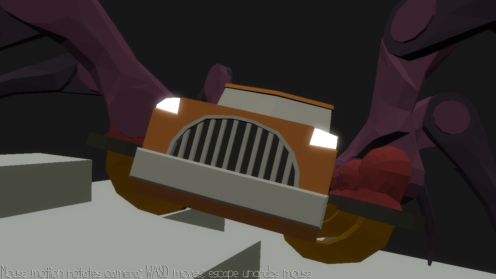

# 15-466 Offscreen Rendering / Framebuffer Example

This example stores high-dynamic-range (linear light) information to an offscreen buffer (in 16-bit-per-channel floating point), blurs that information to simulate single-scattering in the eye, and tone-maps the result for display.

Key implementation notes:
 - a new shader, `LitGlowColorTextureProgram`, is used to make the headlights and taillights emit light (notice also the special loading code that sets up the scene to use this shader for those objects)
 - PlayMode::draw calls `framebuffers.realloc` in order to keep offscreen render targets the same size as the game window
 - PlayMode::draw uses `glBindFramebuffer` to draw to a (non-screen) framebuffer
 - helper functions in Framebuffers.cpp are used to add bloom and to tone map
 - notice the "full-screen triangle with no attributes" vertex shader hack used in the various full-screen shader programs in Framebuffers

Areas for modification or improvement:
 - `ToneMapProgram` (in Framebuffers.cpp) is a good place to adjust the tone mapping curve. Several commented-out examples are there to play with.
 - `bloom_kernel` (in Framebuffers.cpp) computes the blur kernel used for the bloom effect, while `KERNEL_RADIUS` sets its size.
 - the strength of the bloom effect is set by the opacity of the color returned by `BlurYProgram`. Set it to 1.0 and you'll have an "everything looks blurry" effect instead.
 - could use different kernels or sizes for `BlurXProgram` and `BlurYProgram` to make non-symmetric blurs for artistic effect
 - many games compute bloom effects at lower resolution (1/2 or even 1/4) because they are blurry anyway; could consider using a shader (or glBlitFramebuffer) to downsample before `blur_x_program` is run and to upsample after `blur_y_program` is run (you'll also need a few lower-resolution temporary framebuffers to sample to/from)
 - the `min` and `max` in the texelFetch functions exist because texel access beyond texture bounds is undefined unless running in robust mode; these comparisons could likely be avoided or modified to improve performance.

This example uses [NEST](NEST.md).
